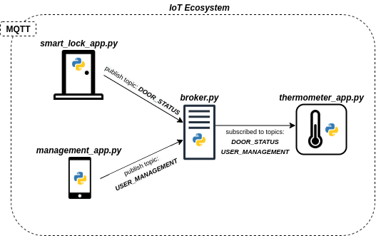

_COEN446, Concordia University, Winter 2020_
# Internet of Things MQTT project

_All commands are for Bash terminals_
## Installation
1. Clone and Pull the project onto your machine via git
> git clone https://github.com/fjodoin/coen446.git

2. navigate to the project directory containing python modules
> cd [PATH_to_dir]/coen446/IoT_modules

3. Pull latest updates via git
> git pull

## Configuration
__MUST HAVE__ Python3 and Pip3 installed on your machine before proceeding
(Optional) Start a Virtual Environment: must have virtualenv package via pip
1. Install the project requirements.txt file before attempting to launch the project; use the following command
>pip3 install -r requirements.txt

## Description
This project emulates a smart home ecosystem with 3 devices connected in a Publisher/Subscriber MQTT architecture. These devices are conntected together via an MQTT gateway known as the __BROKER__ _(broker.py)_ which routes messages via TOPICS; devices only receive _published_ messages from topics they are _subscribed_ to.

- __DEVICE 1: MANAGEMENT APPLICATION__ _(management_app.py)_	(PUBLISHER)
- __DEVICE 2: SMART LOCK APPLICATION__ _(smart_lock_app.py)_	(PUBLISHER)
- __DEVICE 3: THERMOMETER APPLICATION__ _(thermometer_app.py)_	(SUBSCRIBER)
- __DEVICE 4: BROKER__ _(broker.py)_				(GATEWAY)

## HOW TO LAUNCH PROJECT:
1. Open 4 terminals into the /[PATH_to_dir]/coen446/IoT_modules directory
2. Launch the broker.py __FIRST__ from Terminal 1 (connections cannot be established without the broker running.)
> terminal_1#>python3 broker.py
3. Launch the IoT devices from Terminals 2, 3, and 4
> terminal_2#>python3 management_app.py
> terminal_3#>python3 smart_lock_app.py
> terminal_4#>python3 thermometer_app.py 
4. Create a user with a preferred temperature with the __management_app__
4. Enter the username into the __smart_lock_app__ and click _"Entering"_
5. Notice the temperature change automatically on the __thermometer_app__
_All incoming and outgoing messages through the broker is being logged into broker.log_

## ___REBOOT WARNING___
When rebooting the project, you must follow the sequence below in order to avoid socket threading issues. (Known behaviour with serversocket module used in the broker.py module: https://stackoverflow.com/questions/6380057/python-binding-socket-address-already-in-use) 
1. Close all IoT device GUI windows
2. Terminate the Broker.py program by initiating a keyboard-interrupt (ctrl+c) in Terminal 1
_The commandline should be returned immediately_

If you attempt to reboot and the terminal announces that sockets are already in use, double check that all IoT device windows are closed, wait 60 seconds and start from __Step 2__ in the __HOW TO LAUNCH PROJECT__ section above.
